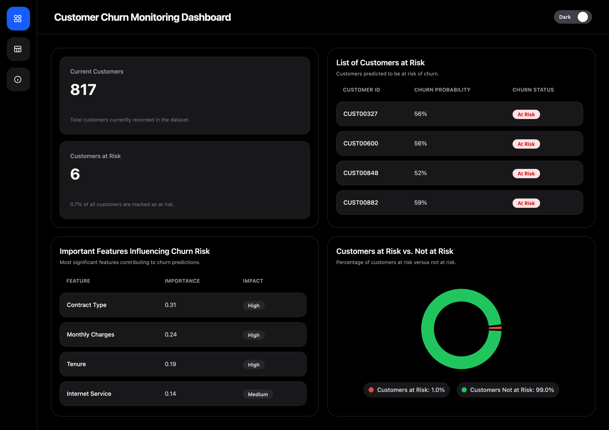

# IBM Customer Churn Monitoring Dashboard

---

## Overview

This project builds a **customer churn monitoring system** using machine learning and an interactive dashboard.

Two datasets are used:

1. **Training Dataset** – IBM Telco Customer Churn (Kaggle)  
   Link: https://www.kaggle.com/datasets/blastchar/telco-customer-churn  
   Used to train and evaluate the churn prediction model.

2. **Monitoring Dataset (Synthetic)**  
   Generated using an LLM to simulate new customers.  
   Used for real-time churn prediction and dashboard monitoring.

---

## Task

Develop a churn monitoring dashboard that:

- Predicts customer churn using a trained ML model  
- Applies the model to new (synthetic) customer data  
- Tracks churn risk using clear KPIs  
- Supports data-driven retention decisions  

---

## What I Did

- Performed **exploratory data analysis (EDA)** to understand customer behavior and churn patterns  
- Cleaned and transformed data for modeling (encoding, feature preparation)  
- Built an **XGBoost classification model** to predict customer churn  
- Evaluated model outputs and extracted **key drivers using feature importance**  
- Defined **business-relevant KPIs** for churn monitoring  
- Generated a **synthetic dataset** to simulate new customer data  
- Applied the trained model to simulate real-world churn prediction  
- Developed a **dashboard to monitor churn risk and support decision-making**

---

## Key KPIs

- **Total Customers**  
  Number of customers in the monitoring dataset  

- **Customers at Risk**  
  Customers predicted as churn = "At Risk"  

- **Churn Rate (%)**  
  (At Risk Customers / Total Customers) × 100  

- **Top Risk Drivers**  
  Most important features influencing churn  

- **High-Risk Customer List**  
  Customers requiring immediate attention  

---

## Dashboard

🔗 https://ibm-telco-customer-churn.vercel.app/

### Features

- Real-time churn prediction  
- KPI monitoring  
- Customer-level risk visibility  
- Feature importance insights  

---

## Key Insights

- Fiber optic internet users show higher churn risk  
- Month-to-month contracts drive higher churn  
- Customers with low tenure are more likely to leave  
- Electronic check payments correlate with churn  
- Lack of add-on services reduces retention  

**Main drivers:** contract type, service type, customer engagement  

---

## Tech Stack

- **Python** – Data cleaning, preprocessing, and analysis  
- **XGBoost** – Machine learning model for churn prediction  
- **React + TypeScript** – Interactive dashboard development  
- **Vercel** – Deployment and hosting  

---

## Output

- Trained churn prediction model  
- Synthetic monitoring dataset  
- Deployed dashboard  
- Actionable business insights  

---